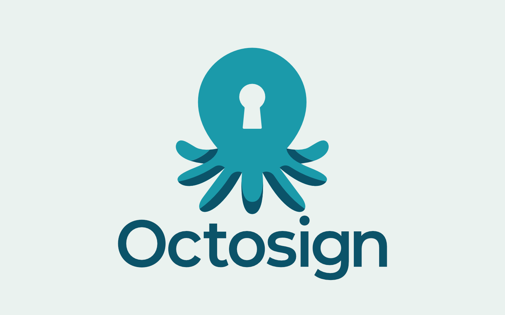
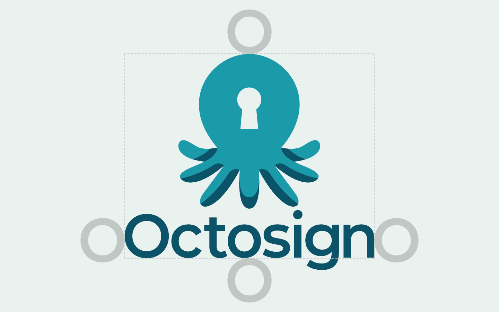
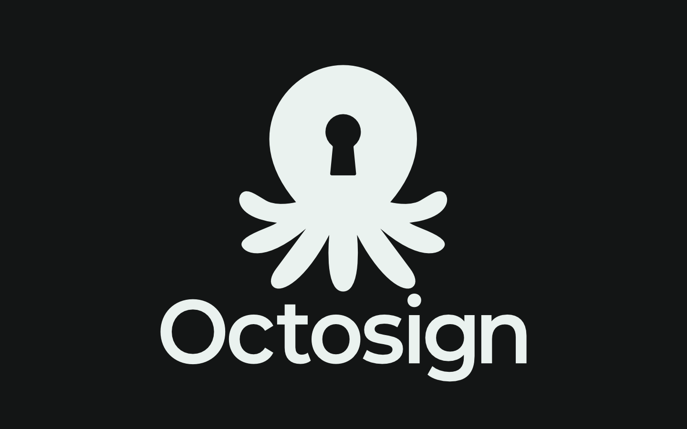
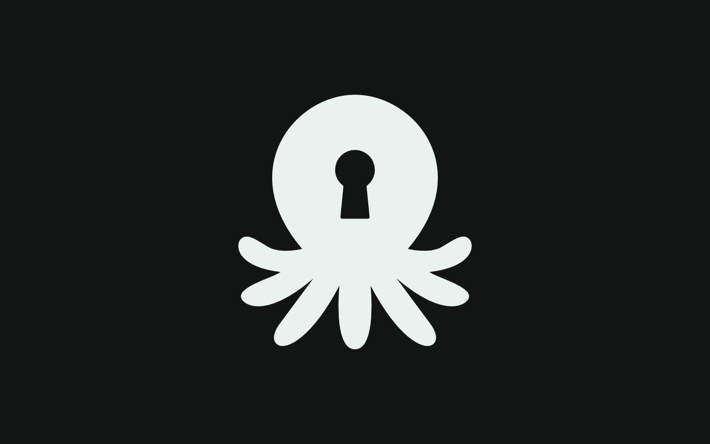
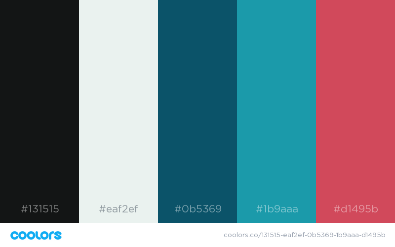

# Brand Guide

## Logo
### Logos for download
| Logo                | Logo - Single Color                | Icon                | Icon - Single Color                |
|-------------------------|----------------------------|---------------------|------------------------|
|[.svg](logo/Logo.svg)|[.svg](logo/Logo_SingleColor.svg)|[.svg](logo/Icon.svg)|[.svg](logo/Icon_SingleColor.svg)|
|[.png](logo/Logo.png)|[.png](logo/Logo_SingleColor.png)|[.png](logo/Icon.png)|[.png](logo/Icon_SingleColor.png)|

### The logo itself
The logo consists of the brand name "Octosign" and an icon. The icon is made of an octopus with a lock as his head - representing safety, and writing ink under his feet - representing writing, signing. 

*The logo*

### The usage of the logo
Though the logo must always consist of the icon and the brand name, the icon can be used separetely without the brand name. The logo or the icon should not be used differently than how it's displayed here - without any visual effects, in other colors, in different aspect ratios and so on.

Empty space around the logo and the icon, called the safe area, must always be used.

When it comes to the logo, it must be used as displayed here:
 

*Watch out for the tail of the letter "g" as it does not count.*

And when it comes to the icon:

This type of the logo and the icon must only be used on a light pre-defined color background. When it comes to different color background, for example a dark background, the single color light version of the logo and the icon must be used.

## Colors
The color palette will open once clicked on the image. 

## Typography

### Roboto
This font is used everywhere.